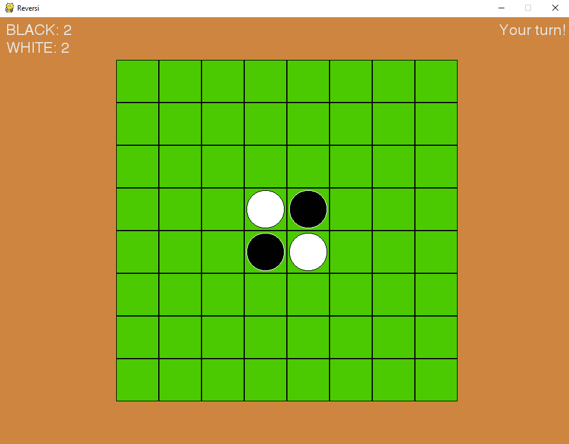

# PyReversi

A Reversi game made with Python3 and pygame that utilize artificial intelligence for the opponent. The algorithm used was Minimax with Alpha-Beta Pruning.

<p align=center>
  
</p>

## To run this code

Make sure that pygame is installed by running this code in the terminal or command line:
```
pip install pygame
```
Then, simply run "runme.py" to start the game.

## Files Information

runme.py - Run this code with Python3 to start the game

ui.py - Code that builds up the game to be interactive

reversifunc.py - Function that runs the Reversi mechanism

globalvar.py - Store its global variable

spriteclass.py - Sprite code for the game

aifunc.py - AI Function, Minimax alogirthm with alpha-beta pruning
